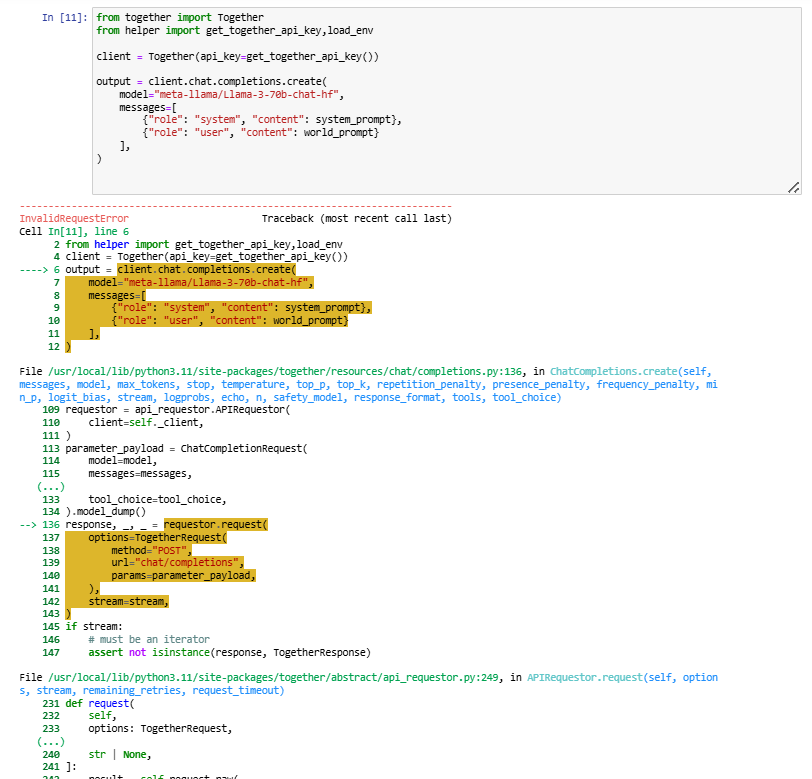
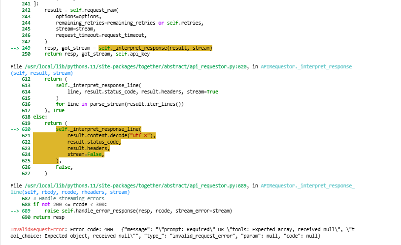
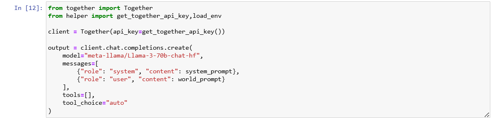

# AI_Powered_Game
This project is a hands-on implementation of an AI-powered, text-based game built using Large Language Models (LLMs). Developed by following the [Building an AI-Powered Game](https://learn.deeplearning.ai/courses/building-an-ai-powered-game) course by Deeplearning.ai in collaboration with Together AI and AI Dungeon, this project demonstrates how to design immersive game worlds, characters, and storylines using hierarchical content generation and prompt engineering.

### Notes and Bugs Fixes
During the course, I came across an "InvalidRequestError" while using the Together API inside the briwser-based Jupyter Notebook environment.

    
    

The Together server was updated recently and it rejects the “null” values passed to “tools” and “tool_choice”. We can pass tools as empty list and have to pass tool_choice as auto. 
Solution: 

    

The reason for using `auto for tool_choice` is because the updated version rejects null. So, auto (non-null value) is a valid enum value being passed to the server. 
The reason for using `tools=[]` is because it is a valid value indicating that no tools are being used.